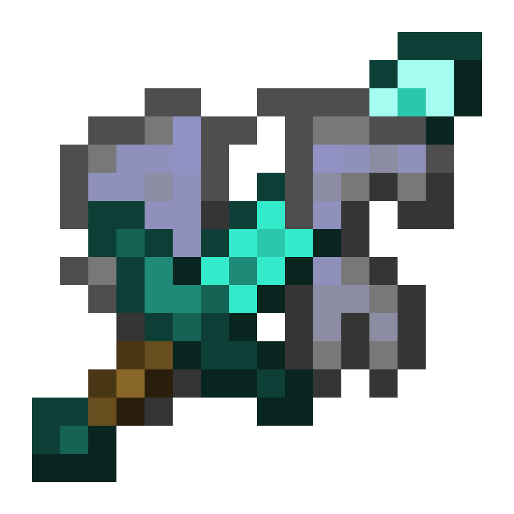

# NoCombatElytra
Very simple server-sided Fabric mod that disables elytra gliding during combat.

## Features

- Configurable combat cooldown (`config/nocombatelytra.json`)
- Works with vanilla clients
- Cooldown resets on respawn and works on real-world time